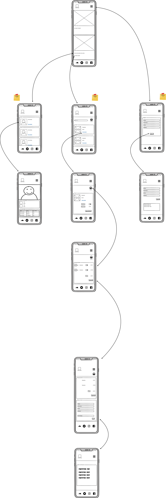
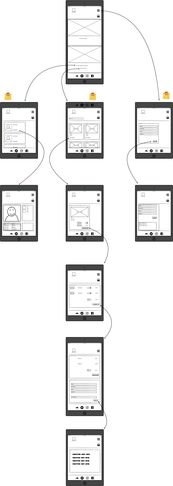
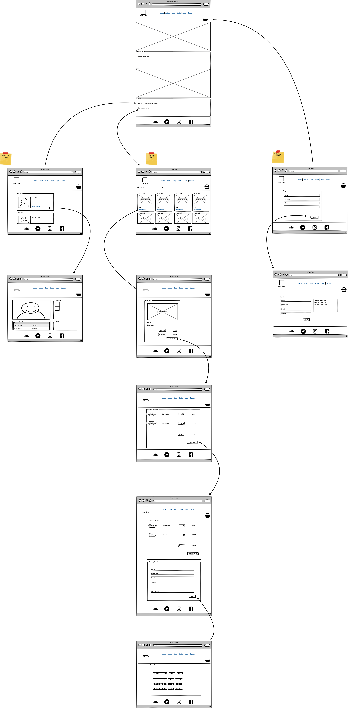
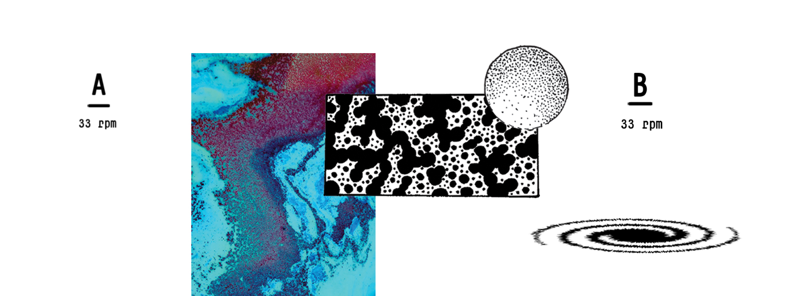
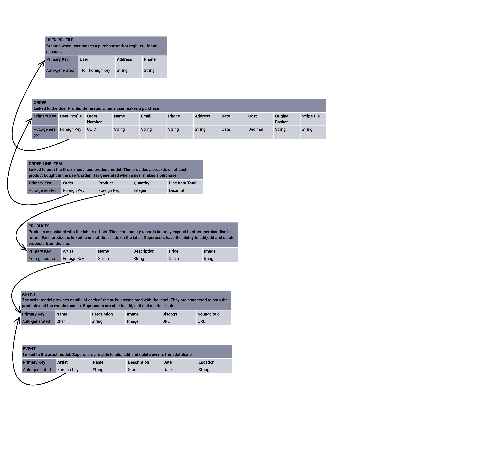

<h1 align="center">
    <a href="https://outerzone.herokuapp.com/" target="_blank"></a>
</h1>

<div align="center">

# Outer Zone Record Label

[Open in GitHub](https://github.com/H4RP3RK/outerzone)

</div>

## Contents Table
1. [Introduction](#introduction)
2. [User Experience](#user-experience)
    - [Client Goals](#client-goals)
    - [Target Audience](#target-audience)
    - [User Goals](#user-goals)
    - [User Stories](#user-stories)
    - [Wireframes](#wireframes)
3. [Design](#design)
4. [Features](#features)
    - [Features on every page](#features-on-every-page)
    - [Features to be implemented](#features-to-be-implemented)
5. [Database](#database)
6. [Technologies](#technologies)
7. [Testing](#testing)
    - [Tools](#tools)
    - [Automated Testing](#automated-testing)
    - [User Testing](#user-testing)
    - [User Feedback](#user-feedback)
    - [Problem Solving](#problem-solving)
8. [Deployment](#deployment)
9. [Credits](#credits)
    - [Content](#content)
    - [Media](#media)
    - [Code](#code)
    - [Acknowledgements](#acknowledgements)

---
## Introduction
A website for record label, Outer Zone, in order to showcases the label's artists and build a community of fans.
Users are able to find out more about the artists, their releases and upcoming gigs. All users are able to purchase products and, those 
who register with the site can save their delivery details for later purchases and see a record of previous orders.

---
## User Experience

### Client Goals
The client is a Glasgow-based independent record label, who specialises in electronic music. Prior to the creation 
of this website, their internet presence was spread across a number of different websites, mainly [Soundcloud](https://soundcloud.com/outer-zone) 
and [Bandcamp](https://outerzone.bandcamp.com/). 

The client requested this website in order to:
* increase the profile of the record label.
* showcase the label's artists, their releases and upcoming gigs.
* provide a one-stop shop for users to find out more about the label and buy their records.

### Target Audience
The target audience are:
- fans of electronic music
- predominately in the 20-45 age bracket
- English speaking
- located anywhere in the world

### User Goals
Users visit the website because they want:
* to find out more about the label and their artists.
* to buy a record or other merchandise.
* details on upcoming events.

### User Stories
1. As a new visitor, I want an introduction to the Outer Zone label and their artists.
2. As a new visitor, I want to browse Outer Zone's releases.
3. As a user of the site, I want to sample the artists' music before I decide to buy.
4. As a user of the site, I want to know about artists' upcoming events.
5. As a user of the site, I want to purchase records.
6. As a user of the site, I want to register for an account.
7. As a registered user, I want to save my delivery details for future purchases.
8. As a registered user, I want to update my delivery details.
9. As a registered user, I want to see a record of my previous purchases.
10. As someone within the electronic music industry, I want to understand more about Outer Zone and the types of sets their artists play.
11. As someone within the electronic music industry, I want to contact Outer Zone in order to work with them.
12. As admin for the site, I want to be able to add products to the site.
13. As admin for the site, I want to be able to edit and delete products on the site.
14. As admin for the site, I want to be able to add artists to the site.
15. As admin for the site, I want to be able to edit and delete artist details on the site.

### Wireframes

#### Member Journey
##### Small Screens


##### Medium Screens


##### Large Screens


---
## Design

The existing branding for the Outer Zone label was used as the basis for the styling of the website.
The artwork for the label's record releases evoke a minimalist, futuristic aesthetic. In order to enhance the brand identity, 
this same approach was used when designing the website. The artwork for the label's second release, Triple M EP (pictured below)
was particularly influential.



### Colours

The colour palette was kept minimal, mainly black and white, with some grey to provide distinction between different texts within the site.
Hints of colour were added through the background image, which borrowed the turquiose and purple artwork used on the Tripe M artwork (above).
These same shades of turquiose and purple were used for the success/error alerts and some anchors.

### Layout

The content sections of the web pages were separated by use of rectangles/squares with sharp edges. At large enough screen ratios, these containers were 
laid out so they were at contrasting alignment to the colourful containers displayed in the background images. This reflects the same layout used on the Triple M
cover and other Outer Zone release artwork.

The only page that differs from this design is the home page, which features full cover background images.
The first image is La Cheetah Club, which is closely associated with the label. This provides a hero image that immediately evokes the music of the label - electronic club music 
made for intimate club venues. The second image is of the club owners, Wardy and Dom, taken outside La Cheetah Club. There's a nice contrast between the images for the small and larger screens,
one the typical serious poses of techno producers and the other of them having a laugh together. This seemed quite representative of the label.
 
### Fonts 

Two different Google Font styles were used for the site:
* [Teko](https://fonts.google.com/specimen/Teko) for the header. This was chosen for its futuristic, robotic appearance that aligned with the brand logo.
* [Oswald](https://fonts.google.com/specimen/Oswald) for the main section of the site. This complemented Teko well and provided good readability.

---
## Features

### On All Pages 
#### Navigation Menu
* The navigation menu is visible on all pages to provide the user with easy navigation throughout the site.
* The Outer Zone logo serves as a link back to the home page, as is convention on most websites. This also aids navigation for users.
* On smaller screens, the navigation menu reduces to a burger in order to de-clutter the header and make better use of space.
* The content of the navigation menu changes, dependent on the sign in credentials of the user:
    - Not signed in - the Sign Up links is visible.
    - Signed in - the Sign Out link appears.
    - Superuser - the Add Product and Add Artist link is also available.

#### Profile/Login Icon 
* Dependent upon whether the user is signed in or out, the person icon can either direct to the user's profile or the sign in page, respectively.
* This is provided as an extension to the header and is visible on all screen sizes, along with icons for the shop and basket, as these are likely to be the most accessed areas of the site.

#### Shop Icon
* This is visible on all pages and all screen sizes, to make it as easy as possible for users to make purchases and highlight that one of the main purposes of the site is for users to buy products.

#### Basket Icon 
* The basket icon not only provides an easy access link to the shopping basket, but also an easily visible sum of the amount that the user plans to spend.

#### Alerts 
* Alerts are used throughout the website to confirm successful user actions or alert the user to errors.

#### Responsive Design
* A responsive grid design ensures that the content is organised in an aesthetically pleasing and practical format on all screen sizes.
* Vh is used to determine font sizes in order to provide good readability and layout on all screen resolutions.

### Home Page
Provides an introduction to the label and the label owners. The background images provide a good representation of the electronic club scene that is at the heart of the label.
Scroll buttons are provided to highlight to the user to scroll down. The scroll effect is used for both the aesthetic value of scrolling past the fixed images, but also to make it 
clear to the user that they are navigating to different areas within the same page.
Links to the artists page and the shop are provided to drive home the main purposes of the site and provide easy navigation.

### Artists 
Displays a simple list of all the artists on the label and their image. This information is drawn from the artist model of the database.
Each is a link to an artist detail page with more information on the artists.

#### Artist Detail 
Each artist has their own web page that provides further information about the artist.
The page displays as a single column in small screens and over two/three columns in larger screens.
* Buy - provides an image of all the products listed for the artist, which also doubles as a link to the product in the shop. This information is drawn from the products model of the database. 
* Events - provides an accordion of all the events associated with the artist. The event title can be clicked in order to reveal the location and description of the event. This information is drawn from the events model of the database.
* Listen - An embedded YouTube video allows the user to sample the music that the artist produces and also doubles as a link to YouTube, to allow the user to listen to more if they wish. This information is pulled from the artists model of the database.
* More - This section provides links to the users social media pages, including their Soundcloud, where the user can hear a selection of the artists tunes and mixes.

### Products
* Products - displayed using the Bootstrap card styling, which has been tailored to suit the needs of the site. Products are listed full width on small screens, two per row on medium screens and four per row on large screens.
* Search Bar - allow the user to search by keyword. If the keyword features in the product name or artist name, the product will display.
* Filter - the filter allows the user to filter by artist. Each artist on the database is automatically listed on the drop down, by pulling the data through from the artists model.
* Sort Options - the sort options allow the user to order products by name, artist or price.

### Product Detail
Each product has a product detail page, which allows the user to add the item to their basket. The single input form allows them to add any quantity from 1 to 99.
The Back to Shop and 

### Basket

### Checkout 

### Order Confirmation

### Profile
* Delivery Details
* Order History

### Add Product
* Form 

### Add Artist 
* Form

### All Auth 
* Sign Up
* Login
* Forgot password
* Sign Out 


### Features to be implemented
* Forum - a chatroom could be implemented to provide users with further reason to sign up for an account. It would help to establish a strong fanbase and community around the label.
* Gig Tickets - other merchandise could be sold on the site, such as gig tickets. An API for a site such as ticketmaster could be useful in setting this up.
* Streaming Gigs - look into APIs that could support the streaming of artists' gigs from the site.

---
## Database 

An SQL database was used for this project. The structure of the relationships between the models are outlined in the diagram below.


---
## Technologies

* [Gitpod](https://www.gitpod.io/)
* [Github](https://github.com/) - version control and storage of the project
* [Heroku](https://dashboard.heroku.com/) - for deployment of the completed website
* HTML and CSS 
* Javascript - used for accordion function on the artist detail page.
* [JQuery](https://jquery.com/) - Javascript library user for the navbar and search/filter functionality on products page.
* [Django](https://www.djangoproject.com/) - Python web framework.
* [Django Crispy Forms](https://github.com/django-crispy-forms) - styling of Django Forms.
* [Stripe](https://stripe.com/en-gb) - to enable payment through the site.
* [Postgres](https://www.postgresql.org/) - A SQL database used to store project data.
* [AWS](https://aws.amazon.com/) - for cloud storage of the static files and media.
* [Bootstrap](https://getbootstrap.com/) - for the responsive grid layout and navbar. All templates were tailored to the needs of the site. 
* [Google Fonts](https://fonts.google.com/) - used to style the website fonts.
* [Font Awesome](https://fontawesome.com/) - icons for certain buttons.

---
## Testing 

Testing details can be found here in [testing.md](TESTING.md)

---
## Deployment 

### Locally

To run this project locally from your own computer, you must first have an IDE installed, as well as PIP, Python3 and Git.
You should also set up an online account with [Stripe](https://stripe.com/en-gb).

1. Go to the [GitHub page](https://github.com/H4RP3RK/outerzone) for the Outer Zone project, click the 'code' button and download the zip file.
Using Git, the repo can be cloned by typing the following command into your terminal:
```
git clone https://github/H4RP3RK/outerzone
```
2. The repository should now be saved locally, so you can open the folder through your IDE.
3. Install all the required modules for the project, as outlined in the requirements.txt file.
4. Set up your environment variables for the following:
    * "DEVELOPMENT": true
    * "SECRET_KEY"
    * "STRIPE_PUBLIC_KEY"
    * "STRIPE_SECRET_KEY"
    * "STRIPE_WH_SECRET"
5. Migrate the models to create the database by using the commands:
```
python3 manage.py makemigrations
python3 manage.py migrate
```
6. Create a superuser account in order to access the database through admin by typing the command:
```
python3 manage.py createsuperuser
```
7. Run the program locally by using the command:
```
python3 manage.py runserver
```
8. Add '/admin' to the URL for the locally created website in order to access the admin database. You'll be asked to type in the username and password you created for your superuser account.
9. From the admin database, you'll be able to add items in each of the models. Add products and artists to get the website up and running.

### Heroku

1. Make sure that there is a requirements.txt file. If not, create one using the command:
```
pip3 freeze > requirements.txt
```
2. Create a Procfile by using the command:
```
echo web: python3 app.py > Procfile
```
3. Push the new requirements.txt and Procfile to GitHub using the commands:
```
git add .
git commit "<message>"
git push
```
4. Go to the [Heroku website](www.heroku.com). If you don't already have an account, create one, then log in.
5. Create a new app for the project. You can do this by clicking on the new button at the top left of the screen, then choose "create new app" from the dropdown.
6. You'll be prompted to give the app a unique name and choose the region most appropriate for your location.
7. On the resources tab, set up a new Postgres database. You can use the free plan.
7. Go to settings > reveal config vars and set the following variables:
    * AWS_ACCESS_KEY_ID
    * AWS_SECRET_ACCESS_KEY
    * DATABASE_URL
    * EMAIL_HOST_PASS
    * EMAIL_HOST_USER
    * SECRET_KEY
    * STRIPE_PUBLIC_KEY
    * STRIPE_SECRET_KEY
    * STRIPE_WH_SECRET 
    * USE_AWS
8. Go to the deploy tab of your Heroku dashboard and link your Heroku app with your GitHub. Tick the box for automatic deployment.
9. Back in your IDE terminal, login to Heroku with the command:
```
heroku login -i
```
10. Migrate all your data by using the command:
```
python3 manage.py migrate
```
11. Load in the data one model at at a time, using the command below. Start with the artists file.
```
python3 manage.py loaddata <data name>
```
12. Create a superuser account for yourself using the command:
```
python3 manage.py createsuperuser
```
13. Git add, commit and push your changes (see step 3). Go back to your Heroku dashboard and, once the app build is complete, open the app using the URL provided on settings > domains.
14. Your project should now be live.
15. You can read, create, update and delete data by adding '/admin' to the domain URL and logging in with your superuser details.

---
## Credits 
### Content 
* The text content was mainly created for the Outer Zone label or are from articles about the label.
* Some text for mock artist profiles is from the Resident Advisor website.

### Media 
* The majority of the images are owned by the Outer Zone label.
* Some images of artists are taken from the Resident Advisor site and names have been changed to create mock artist profiles.

### Code 
* The Code Institute tutorials for the Boutique Ado website provided the basis for the majority of the website. Views, models and forms were then tailored to suit the specific needs of the site.
* The Bootstrap library was used for the alerts, navbar and product cards. The HTML and CSS was then tailored to fit with the aesthetic of the site.
* The webhooks code are mainly taken from the [Stripe](https://stripe.com/en-gb) documentation and tweaked to suit the needs of this project. The tweaks were aided by the Code Institue Boutique Ado tutorials.

### Acknowledgements
* Thanks to Wardy and Dom for the inspiration for the site.
* Thanks to my mentor for Jonathan Munz for all his help throughout this project and the whole course. 


**** MY NOTES ONLY - NOT PART OF FINAL README ****

pip3 install:
django
django-allauth
django-crispy-forms
stripe
Pillow
django-countries
dj_database_url
psycopg2-binary
gunicorn

Jonathan 12.11.2020
Checkout


Jonathan 27.11.2020

# To Do
* Testing - Lighthouse (in GoogleDev inspect section) analyses site. Can screenshot it
* Testing - Stripe has dummy credit card details that show different errors
* Change photos for smaller screens
* Fix image resolutions on home page 
* Add if statements so only completed links appear on artist page 
* Add link to artist page on products page.
* Products - if no products by that artist, display a message so page can be refreshed
* Edit/Delete artist
* More comments on webhooks. URLs to Stripe documentation. Particularly on the delay on checkout 
* webhooks aren't working.


# Done 
* Get MEDIA_URL to work on html (nav logo and product images)
* Home - center container on small screens
* Home - fix layout of photos
* Home - turn arrows into buttons
* Artists - add artists page
* Events - add events html
* Products - search bar not working
* Products - Fix sort by name.
* Products - Get filter by Artist to work
* Products - use for statement to run through filter artists
* Products - fix margins and positioning of basket
* Basket - fix delete
* Basket - fix update quantity
* Checkout - grand total not pulling through to admin?
* Checkout - move complete order btn to right
* Comments - add comments to show code borrowed from elsewhere
* Mini Checkout - amend layout
* Artist - Get records to show on page
* Events - add model 
* Change navbar font to white, whilst still being able to see burger.
* Why is there overflow on smaller screens?
* Where do I store JSON if data needs to be accessed in multiple apps?
* Login - add styling for anchors
* Buttons - why is btn writing white?
* Fix padding and text size for smaller screens 
* Fonts - vh for headings
* Messages - add messages
* Profile - why is updated details not working?
* Checkout - amend styling of country input
* Products - fix the search bar alignment
* Checkout - Do I need extra css file for checkout?
* Disable verifications step or link to send email
* SQLite committed to repo. Add to gitignore, but only later when close to end.
* SECRET_KEY and DEBUG variables 
* Order and OrderLineItem. Don't save to the database. Write line total as property on the model.
* Reading to do, Jonathan sent on Slack
* Fix arrows on home page
* Give instructions for creating superuser
* Update artist JSON with new fields
* Products - Search bar isn't working.
* Fix readme logo
* Profile - add name to page

# Project Requirements
## Main Technologies
* HTML, CSS, JavaScript, Python+Django
* Relational database (recommending MySQL or Postgres)
* Stripe payments
* Additional libraries and APIs

## Mandatory Requirements
A project violating any of these requirements will FAIL
* Django Full Stack Project: Build a Django project backend by a relational database to create a website that allows users to store and manipulate data records about a particular domain.
* Multiple Apps: The project must be a brand new Django project, composed of multiple apps (an app for each potentially reusable component in your project).
* Data Modeling: Put some effort into designing a relational database schema well-suited for your domain. Make sure to put some thought into the relationships between entities. Create at least 2 custom django models beyond the examples shown on the course
* User Authentication: The project should include an authentication mechanism, allowing a user to register and log in, and there should be a good reason as to why the users would need to do so. e.g., a user would have to register to persist their shopping cart between sessions (otherwise it would be lost).
* User Interaction: Include at least one form with validation that will allow users to create and edit models in the backend (in addition to the authentication mechanism).
* Use of Stripe: At least one of your Django apps should contain some e-commerce functionality using Stripe. This may be a shopping cart checkout, subscription-based payments or single payments, donations, etc. After paying successfully, the user would then gain access to additional functionality/content on the site. Note that for this project you should use Stripe's test functionality, rather than actual live payments.
* Structure and Navigation: Incorporate a main navigation menu and structured layout (you might want to use Bootstrap to accomplish this).
* Use of JavaScript: The frontend should contain some JavaScript logic you have written to enhance the user experience.
* Documentation: Write a README.md file for your project that explains what the project does and the value that it provides to its users.
* Version Control: Use Git & GitHub for version control.
* Attribution: Maintain clear separation between code written by you and code from external sources (e.g. libraries or tutorials). Attribute any code from external sources to its source via comments above the code and (for larger dependencies) in the README.
* Deployment: Deploy the final version of your code to a hosting platform such as Heroku.
* Security: Make sure to not include any passwords or secret keys in the project repository. Make sure to turn off the Django DEBUG mode, which could expose secrets.

# Assessment Criteria
Your Full-stack Django project will be assessed based on the following criteria:

### Usability and Visual Impact:
* Project Purpose
* UX design
* Suitability for purpose
* Navigation
* Ease of use
* Information Architecture
* Defensive Design
### Layout and Visual Impact:
* Responsive Design
* Image Presentation
* Colour scheme and typography
### Code Quality:
* Appropriate use of HTML
* Appropriate use of CSS
* Appropriate use of JavaScript
* Appropriate use of Python
* Appropriate use of the template language
* Appropriate use of Django
### Application Features:
* App logic
* Cross-app logic
* E-commerce
* Authentication and Security
### Software Development practices:
* Directory Structure and File Naming
* Version control
* Testing implementation
* Testing write-up
* Readme file
* Comments
* Data store integration
* Deployment implementation
* Deployment write-up